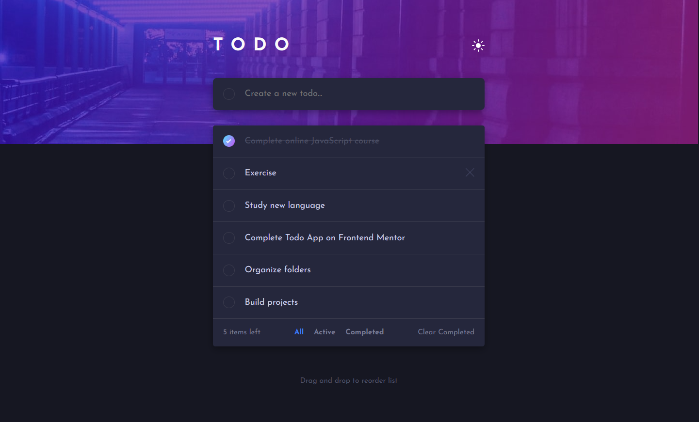
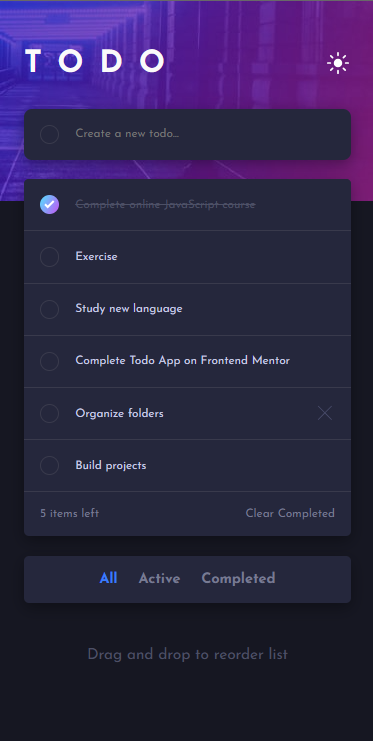

# Frontend Mentor - Todo app solution

This is a solution to the [Todo app challenge on Frontend Mentor](https://www.frontendmentor.io/challenges/todo-app-Su1_KokOW). Frontend Mentor challenges help you improve your coding skills by building realistic projects. 

## Table of contents

- [Overview](#overview)
  - [The challenge](#the-challenge)
  - [Screenshot](#screenshot)
  - [Links](#links)
- [My process](#my-process)
  - [Built with](#built-with)
  - [What I learned](#what-i-learned)
  - [Continued development](#continued-development)
  - [Useful resources](#useful-resources)
- [Author](#author)
- [Acknowledgments](#acknowledgments)

## Overview

### The challenge

Users should be able to:

- View the optimal layout for the app depending on their device's screen size
- See hover states for all interactive elements on the page
- Add new todos to the list
- Mark todos as complete
- Delete todos from the list
- Filter by all/active/complete todos
- Clear all completed todos
- Toggle light and dark mode
- Drag and drop to reorder items on the list

### Screenshot

- Desktop version

- Mobile version

### Links

- Live Site URL: [Live site at Vercel]()

## My process

### Built with

- Semantic HTML5 markup
- Flexbox
- [React](https://reactjs.org/) - JS library
- [TypeScript](https://www.typescriptlang.org/)
- [SASS](https://sass-lang.com/) - For styles

### What I learned

In this project i deepen my knowledge in TypeScript as well as practice my SASS skills(first project with it). I learned that using SASS for theming is somewhat hard, but could find a good solution nonetheless. 

### Continued development

I will continue developing my TypeScript skills further as i think very highly of this leanguage and it's benefits, despite it's hight complexity. With this project i could see the power of SASS and will be learning and experimenting on it to build up my knowledge with this pre-processor.

### Useful resources

- [W3Schools](https://www.w3schools.com/)
- [MDN Web Docs](https://developer.mozilla.org/en-US/)
- [Dev em Dobro](https://github.com/devemdobro)

## Author

- Github - [viniciusmontibeller](https://github.com/viniciusmontibeller)
- Frontend Mentor - [@viniciusmontibeller](https://www.frontendmentor.io/profile/viniciusmontibeller)

## Acknowledgments

I got to say that i'm really happy to be studying with the lessons by [Dev em Dobro](https://github.com/devemdobro). I started with zero programing skills and now i can see that i'm growing little by little into what i wanted to be.
